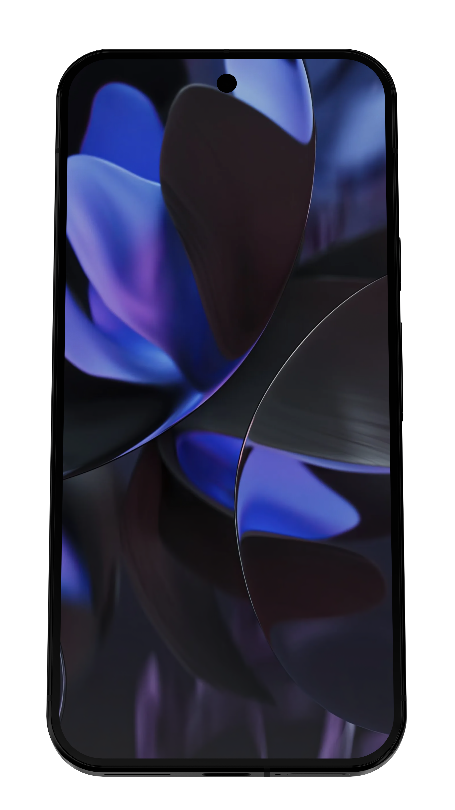
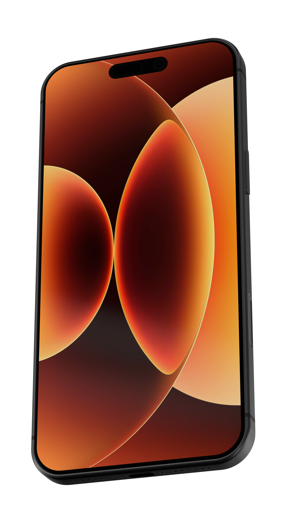
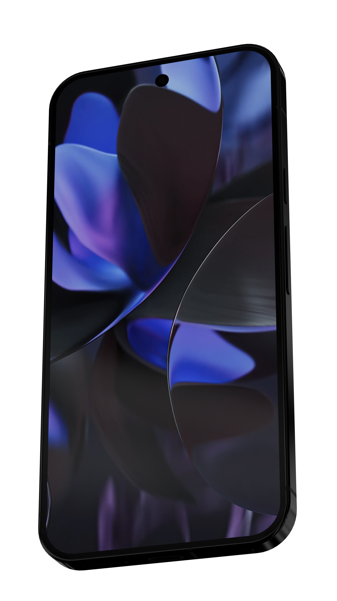
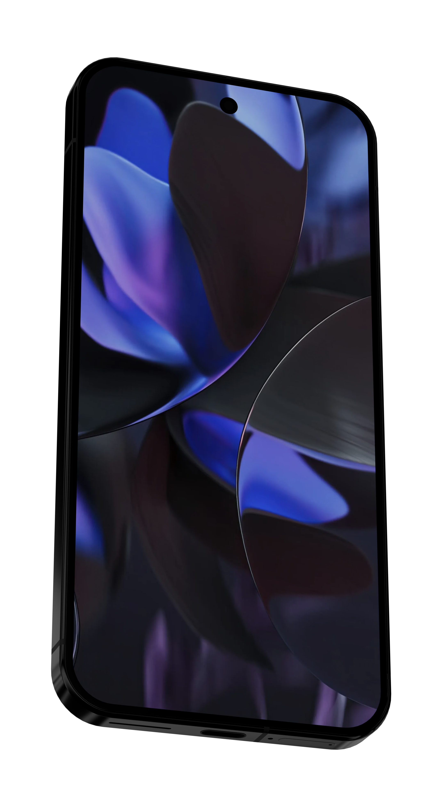
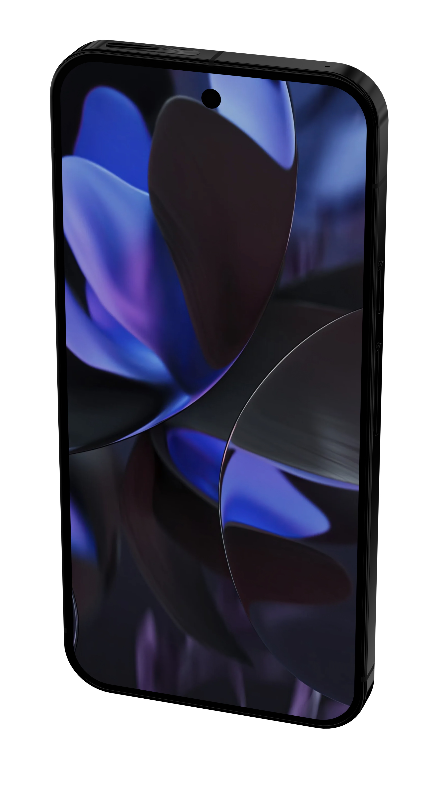
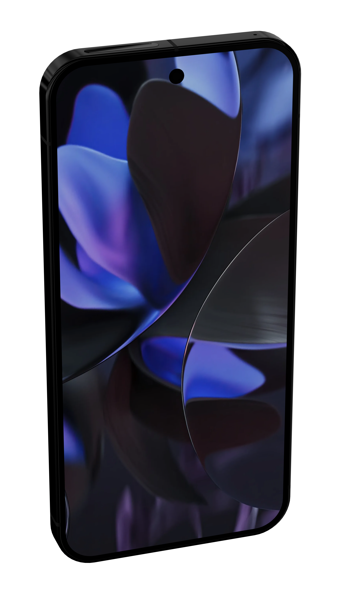
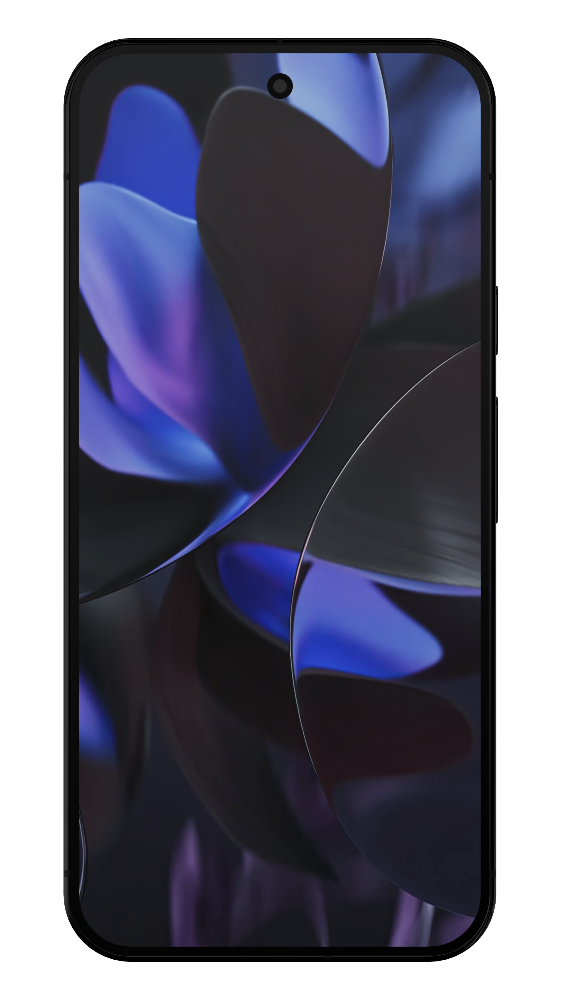

# PhoneRenders

Batch-render beautiful 3D phone mockups for the App Store / Play Store from
flat screenshots, using Blender and a single Python script.

Drop your screenshots into `screenshots/iOS/` or `screenshots/Android/`, run
`render.bat` / `render.sh`, and you'll get a folder of
`{screen}__{angle}.png` images - one per camera angle per screenshot, per
platform - rendered with Cycles on a transparent background so they
composite cleanly onto marketing artwork. Optional silhouette SVGs can be
generated alongside the PNGs.

## How to use

### 1. Install

- **Blender 4.2+** (uses GPU OpenImageDenoise and the light tree).
- **Git LFS** - the `.blend` and HDRI are stored via LFS.
- A discrete GPU is recommended (OptiX / CUDA / HIP / oneAPI / Metal are
  auto-detected); CPU works too.

```bash
git lfs install
git clone https://github.com/dthomson117/PhoneRenders.git
cd PhoneRenders
```

### 2. Capture clean screenshots

The 3D phone wraps your screenshot onto a flat rectangular screen, so feed
it **flat, full-bleed PNGs with no rounded corners, notch / Dynamic Island
mask, or OS overlays**. Any holes in the source PNG will show up in the
render.

**iOS Simulator** - take screenshots through `simctl` so the device mask
isn't baked in:

```bash
xcrun simctl io booted screenshot --mask=ignored ios-screen.png
```

Real iOS devices already produce flat rectangles via the side-button combo
or Xcode's *Devices and Simulators → Take Screenshot*.

**Android** - capture through `adb`:

```bash
adb exec-out screencap -p > android-screen.png
```

On PowerShell that redirect can corrupt the PNG; use Git Bash / cmd, or
this two-step form:

```bash
adb shell screencap -p /sdcard/s.png && adb pull /sdcard/s.png && adb shell rm /sdcard/s.png
```

For Android Studio, take screenshots via the emulator toolbar with
*"Show device frame"* turned off.

### 3. Drop them in

Copy each platform's screenshots into the matching folder. `.png`, `.jpg`,
`.jpeg`, and `.webp` all work. The filename (minus extension) becomes the
output prefix - `record-bench-press.png` → `record-bench-press__front.png`,
`record-bench-press__hero_top.png`, etc.

```bash
cp ~/ios-screens/*.png     screenshots/iOS/
cp ~/android-screens/*.png screenshots/Android/
```

### 4. Render

| Platform                        | Command                                                      |
| ------------------------------- | ------------------------------------------------------------ |
| Windows                         | double-click `render.bat`                                    |
| macOS / Linux / Git Bash / WSL  | `./render.sh`                                                |
| Any                             | `blender --background phones.blend --python render_screens.py` |

Both launchers accept an optional platform filter - `ios`, `android`, or
`both` (default). Renders land in `renders/iOS/` and `renders/Android/`.

If the launchers can't auto-discover Blender (they check `BLENDER_EXE`,
`PATH`, common install locations, and on Windows the
`HKLM\Software\BlenderFoundation` registry key), point them at it
manually:

```bash
BLENDER_EXE=/path/to/blender ./render.sh
```

```bat
set BLENDER_EXE=C:\path\to\blender.exe && render.bat
```

## Example output

The repo ships with one default screenshot per platform and the six
angles rendered for each:

| Angle | iOS | Android |
| --- | --- | --- |
| `front`                  |  |  |
| `threequarter_left`      |  |  |
| `threequarter_right`     |  |  |
| `threequarter_left_top`  |  |  |
| `threequarter_right_top` |  |  |
| `hero_top`               |  |  |

Default phones shipped in the `.blend`:

- **iOS** - iPhone 17 Pro Max
- **Android** - Google Pixel 9 Pro XL

Both render at **1440 × 2560** with a transparent background. Adjust
`resolution` in `render_settings.json` for larger or smaller output.

## How it works

`render_screens.py` runs inside Blender (it imports `bpy`) and delegates
to the `render_lib/` package. For each phone defined in `phones/*.json`:

1. Finds the phone object and locates its **screen Image Texture node** -
   by `screen_node_id` (matched against node name *or* label), or by
   falling back to the first image node in the screen material.
2. Builds **one camera per `angles` entry** by computing a bounding box
   around the phone and framing it with `fit_margin` padding so every
   render is composed identically. Angles are described in degrees
   (`tilt_deg` away from the screen normal, `yaw_deg` around the phone).
3. Iterates the platform's `screens_dir`, swaps each image into the
   screen texture node, and renders the full set of cameras - optionally
   producing PNGs with a shadow-catcher pass, PNGs with no shadow, and
   silhouette SVGs traced from the no-shadow alpha.

A few quality details:

- **Cycles + OpenImageDenoise (GPU)** is preferred over OptiX -
  OptiX tends to hallucinate asterisk-shaped artefacts on tiny dark
  features like speaker grilles.
- Adaptive sampling is tuned for fine detail
  (`threshold=0.01`, `min_samples=16`).
- Caustics are off and `blur_glossy=1.0` suppresses fireflies on the
  chamfered phone edges and glass.
- A compositor alpha-threshold step crushes near-transparent denoiser
  fringes so the cutout edge stays crisp.
- Missing external image references in the shipped `.blend` are silently
  swapped for a 1×1 transparent fallback so an out-of-date texture path
  can't break your render.

## Configuration: `render_settings.json`

Settings are loaded from the first match of:

1. The path in the `RENDER_SETTINGS` environment variable
2. The folder containing `render_screens.py`
3. The folder containing the loaded `.blend`

The file is split into two sections - `basic` for everyday knobs and
`advanced` for fine-tuning - plus a top-level `phones_dir`:

```json
{
  "basic":    { /* output, resolution, samples, device, outputs, key_light */ },
  "advanced": { /* framing, lighting, shadow catcher, SVG, angles, ... */ },
  "phones_dir": "phones"
}
```

You only need to override what you want to change; missing keys fall back
to the built-in defaults (see `render_lib/settings.py`).

### `basic`

| Key | Type | What it does |
| --- | --- | --- |
| `output_dir` | path | Where renders are written. `//` is Blender-relative. |
| `resolution.x` / `resolution.y` | int | Render size in pixels. |
| `resolution_percentage` | int | Scales the render (50 = half-res preview). |
| `samples` | int | Cycles samples (override with `RENDER_SAMPLES` env var). |
| `transparent_background` | bool | Film alpha for compositing. |
| `device` | `"GPU"` / `"CPU"` | Cycles render device. |
| `outputs` | object | Which outputs to write - `png_with_shadow`, `png_no_shadow`, `svg_no_shadow`. |
| `key_light` | bool | Add a high-intensity directional key light to brighten the phone. |

### `advanced`

| Key | Type | What it does |
| --- | --- | --- |
| `use_auto_tile` / `tile_size` | bool / int | Cycles tiling. |
| `use_persistent_data` | bool | Reuse BVH between frames - faster. |
| `fit_margin` | float | Padding around the phone when framing (1.08 = 8% margin). |
| `shadow_fit_margin` | float | Same, but used on the with-shadow pass (usually a bit wider). |
| `default_lens_mm` | float | Starting focal length before auto-fit. |
| `supported_extensions` | string[] | Filename extensions treated as screenshots. |
| `view_transform` / `view_look` | string | Blender colour-management view + look. |
| `view_exposure` / `view_gamma` | float | Exposure and gamma applied at view-transform time. |
| `shadow_catcher_size_multiplier` | float | Scale of the catcher plane vs. the phone footprint. |
| `shadow_catcher_z_offset` | float | Raise / lower the catcher in metres (negative = up). |
| `alpha_threshold` | float | Compositor cutoff that snaps near-transparent pixels off (0 = disabled). |
| `key_light_*` | various | Strength, elevation, angle, shadow azimuth, RGB colour, and visibility flags for the optional key light. |
| `phone_isolate_indirect` | bool | Hide the phone from indirect bounces during the shadow pass, so reflected phone colour doesn't tint the catcher. |
| `svg_alpha_threshold` | float | Alpha cutoff used when tracing the silhouette SVG. |
| `svg_outline_simplify_tolerance_px` | float | Douglas-Peucker tolerance for the SVG outline (smaller = more vertices). |
| `angles` | array | Camera angles, see below. |

### `angles`

Each angle is a small object:

```json
{ "name": "threequarter_left", "tilt_deg": 30, "yaw_deg": 215, "distance_multiplier": 1.0 }
```

- `name` becomes the filename suffix (`{screen}__{name}.png`).
- `tilt_deg` is the angle between the camera and the screen normal
  (0 = straight on, 90 = edge-on).
- `yaw_deg` is the rotation around the phone (0 = top, 90 = right edge,
  180 = bottom, 270 = left edge).
- `distance_multiplier` scales the auto-computed camera distance.

Add, remove, or reorder angles freely - the script just iterates the list.

## Per-phone configs (`phones/`)

Each phone gets its own JSON file in `phones/`. The filename (minus
`.json`) is the scene name and must match a Blender scene of the same
name in `phones.blend`:

```
phones/
├── iOS.json       → renders the "iOS" scene
└── Android.json   → renders the "Android" scene
```

A phone file looks like:

```json
{
  "phone_object":    "iPhone 17 ProMax",
  "screen_material": "17ProMax_Screen",
  "screens_dir":     "//screenshots/iOS/",
  "screen_node_id":  "ScreenTextureiOS",

  "shadow_catcher_z_offset": -0.003
}
```

Required keys:

- `phone_object` - Blender object name (as in the scene's outliner).
- `screen_material` - the material whose image-texture node holds the
  screen content.
- `screens_dir` - folder of screenshots to iterate (`//` is .blend-relative).
- `screen_node_id` - **recommended**. Unique name *or* label on the screen
  Image Texture node so the script never has to guess which node is the
  screen. If omitted, the script falls back to the first image node in
  the screen material.

Optional - screen UV behaviour:

- `autofit_screen_uvs` *(default `true`)* - normalise the screen face's UV
  bbox to 0..1 via a generated Mapping node so the screenshot fills the
  whole face regardless of how the mesh was unwrapped. Set `false` to
  honour the .blend's hand-laid UVs verbatim - useful when rounded screen
  corners crop UI content and you want to inset by scaling the UV island
  in the UV editor. When disabled, the Image Texture node is also forced
  to `Extension: Clip` so the area outside 0..1 renders transparent.
- `screen_inset` *(default `0.0`)* - fraction (0..0.49) to shrink the
  screenshot inward on every side when autofit is enabled. Use this when
  rounded display corners crop status-bar icons (e.g. `0.02` leaves a 2%
  transparent margin). Ignored when `autofit_screen_uvs` is `false` (use
  the UV editor instead).

Optional - per-phone overrides. Any framing, shadow-catcher, key-light,
or alpha-threshold setting from `advanced` can be overridden per phone.
The resolved values are printed under `[overrides] per-scene values in
effect:` in the log. Supported keys:

- `fit_margin`, `shadow_fit_margin`
- `shadow_catcher_size_multiplier`, `shadow_catcher_z_offset`
- `alpha_threshold`
- `key_light`, `key_light_strength`, `key_light_elevation_deg`,
  `key_light_angle_deg`, `key_light_shadow_azimuth_deg`, `key_light_color`,
  `key_light_visible_glossy`, `key_light_visible_transmission`
- `phone_isolate_indirect`
- `outputs` (`png_with_shadow` / `png_no_shadow` / `svg_no_shadow`)

For example, the shipped `phones/iOS.json` raises the catcher plane by
3 mm with `shadow_catcher_z_offset: -0.003` to compensate for the iPhone
17 Pro Max's deep camera plateau, which would otherwise leave the catcher
floating too far below the body and wash the shadow out.

**Adding a new phone:** add a Blender scene of the right name to
`phones.blend`, then drop `phones/<SceneName>.json` listing the object
name, material, and screenshots folder. No code changes, no edits to
`render_settings.json`.

**Choosing a different directory:** set `phones_dir` in
`render_settings.json` to any path (relative to the settings file,
absolute, or `//`-relative to the .blend). Set it to an empty string to
fall back to a legacy inline `scenes` block (still supported for
back-compat).

**Naming override:** if a JSON file's stem isn't the Blender scene name
you want, add `"name": "OtherSceneName"` inside the file - that wins
over the filename.

## Customising the .blend

The shipped scenes assume the **phone screen faces +Z, with the UI top at
-Y and the UI right at +X**. If you swap in a different phone model,
rotate it in object mode so the local axes match - the camera math
relies on it.

For each new phone:

1. Drop the model into the right Blender scene (`iOS`, `Android`, or a
   new scene you define by adding a JSON file under `phones/`).
2. Make sure the screen face has its own material.
3. Add an **Image Texture** node to that material, connect its `Color`
   output to both `Base Color` and `Emission Color` on the BSDF, and give
   the node a unique **name** or **label** (e.g. `ScreenTextureiOS`).
4. Put that same string into `phones/<SceneName>.json`'s `screen_node_id`.

## Environment-variable overrides

| Variable | Effect |
| --- | --- |
| `RENDER_SETTINGS` | Path to an alternative settings JSON. |
| `RENDER_SAMPLES` | Overrides `samples` for a single run (handy for previews). |
| `RENDER_PLATFORMS` | Comma-separated platform filter (e.g. `iOS`, `Android`). Set automatically by `render.bat` / `render.sh` when you pass `ios` / `android`. |
| `BLENDER_EXE` | Skip the launcher's auto-discovery and use a specific Blender binary. |

Example - low-sample preview pass with a custom settings file:

```bash
RENDER_SETTINGS=./render_settings.preview.json \
RENDER_SAMPLES=64 \
blender --background phones.blend --python render_screens.py
```

## Repository layout

```
.
├── phones.blend          # Phone models + scenes (Git LFS)
├── render_screens.py     # Tiny entry point that imports render_lib
├── render_lib/           # Settings / GPU / lighting / cameras / compositor / SVG
├── render_settings.json  # Global parameters (basic + advanced sections)
├── phones/               # One JSON file per phone (scene-name = filename)
│   ├── iOS.json
│   └── Android.json
├── render.bat            # Windows launcher with Blender auto-discovery
├── render.sh             # macOS / Linux / Git Bash / WSL launcher
├── hdr/                  # Studio HDRI used in the .blend (Git LFS)
├── screenshots/
│   ├── iOS/              # Drop your iOS screens here
│   └── Android/          # Drop your Android screens here
└── renders/
    ├── iOS/              # Renders land here
    └── Android/
```

## Contributing

PRs welcome - especially for new phone models, additional camera angles,
or backgrounds / studio setups. See [`CONTRIBUTING.md`](./CONTRIBUTING.md).

## License

[MIT](./LICENSE) © David Thomson
